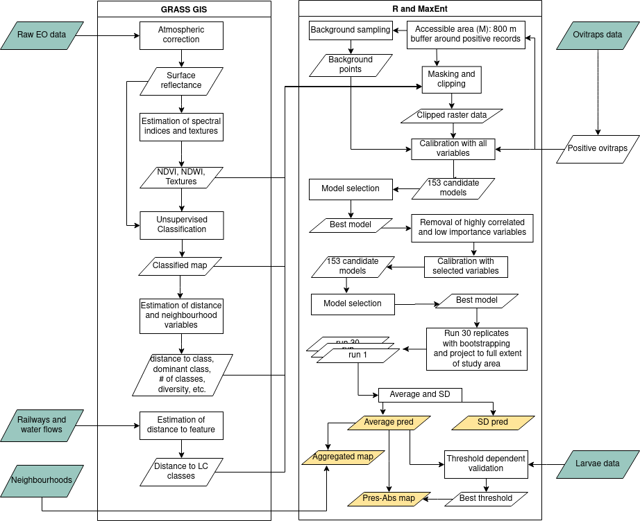

## Towards a workflow for operational mapping of *Aedes aegypti* at urban scale based on remote sensing

This repo holds the scripts that we have developed towards an 
operational workflow for mapping dengue vectors in urban areas 
(manuscript submitted to *Remote Sensing Applications*). 

The scripts were originally developed using SPOT as input
imagery, but these can be replaced by Sentinel 2 level 2A data 
in order to avoid the atmospheric correction step and automate 
the ingest of satellite data. 

All image processing was done with 
[GRASS GIS 7.8+](https://grass.osgeo.org/download/). 
The scripts assume that the users have the software, all dependencies and
extensions installed. Moreover, it requires that the 
[*GRASS DATABASE*](https://grass.osgeo.org/grass78/manuals/grass_database.html) 
is properly set with locations and mapsets created accordingly. For extra
info, visit the [first time users](https://grass.osgeo.org/learn/newcomers/) 
and [tutorials](https://grass.osgeo.org/learn/tutorials/) pages in the
GRASS GIS website.

The order in which scripts should be used is as follows:

1. `grass_scripts/data_import.sh`: This script imports ancillary data like DEM 
from SRTM and vectorial data like water bodies, railway lines, neighborhood polygons.
1. `grass_scripts/img_processing.sh`: This script imports SPOT data and does all 
the image processing for one scene. It requires some variables to be set by the user. 
The atmospheric correction step requires also intervention to create simple files 
with specific parameters. In the end, it exports all relevant raster maps and removes
them from the mapset.
1. `r_scripts/modeling.r`: This is the core script that performs calibration, variable
selection, model selection and threshold independent evaluation. It requires 
intervention in identifying the best models and copying relevant files to produce 
the final predictions.
1. `r_scripts/thres_depen_validation.r`: This script uses independent data (in this
case, from larval samplings) to perform a threshold dependent validation. It requires
intervention to determine the best threshold that is then used to create presence-
absence maps.
1. `r_scripts/output.r`: This script creates the outputs of the workflow: average 
probability and standard deviation; average probability per neighborhood and 
presence-absence binary maps. 

**TO DO**:

- Replace SPOT by Sentinel 2 data. Use [GRASS GIS](https://grass.osgeo.org/) 
modules [i.sentinel.*](https://grass.osgeo.org/grass78/manuals/addons/i.sentinel.html) 
to search for available scenes, filter by location and cloud cover, download, 
import and mask clouds and clouds' shadows. 
- Improve mosquito data flow with Health Authorities so data can be ingested automatically.
- Improve modeling and validation steps that still require intervention, i.e., 
copying of environmental layers, threshold selection.
- Update threshold dependent validation to use a package available in R 4.0 
(*SDMTools* runs up to R 3.6)
- Automatically generate a report from output maps to be sent to Health Authorities.
- Upload output raster and vector maps to a webGIS. 